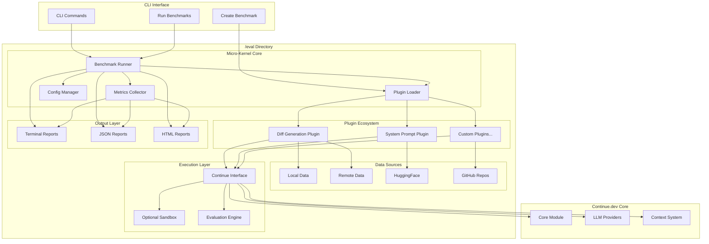
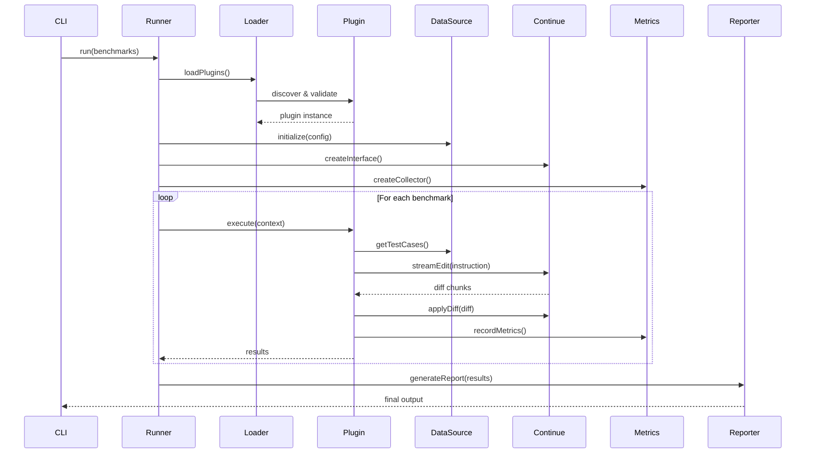
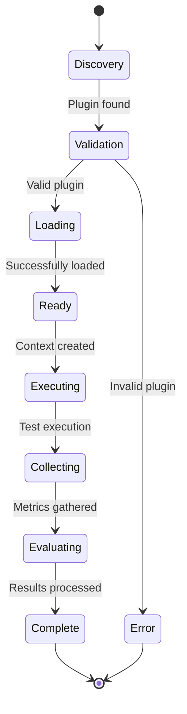

# Continue.dev Benchmarking Framework - High-Level Architecture

## Design Overview

Based on GitHub issue #4906 and community feedback, this architecture implements a **micro-kernel design** focused on **diff generation/application testing** that lives entirely within the `/eval` directory. The framework supports both local and remote data sources while maintaining simplicity for "at home" testing.

## Architecture Diagram

## Component Descriptions

### 1. CLI Interface Layer

**Purpose**: User interaction and command execution entry point

**Components**:
- **CLI Commands**: Main command-line interface for running benchmarks
- **Create Benchmark**: One-shot command to scaffold new benchmark plugins
- **Run Benchmarks**: Execute specific or all benchmarks with various options

**Responsibilities**:
- Parse command-line arguments and options
- Initialize benchmark runner with appropriate configuration
- Handle user input validation and error messaging
- Provide progress feedback during execution

### 2. Micro-Kernel Core

**Purpose**: Minimal, flexible infrastructure that orchestrates benchmark execution

**Components**:

#### Benchmark Runner
- **Role**: Central orchestration engine for all benchmark operations
- **Responsibilities**: Plugin lifecycle management, execution coordination, result aggregation
- **Key Features**: Sequential execution (parallel support in future), progress tracking, error handling

#### Plugin Loader
- **Role**: Dynamic discovery and loading of benchmark plugins
- **Responsibilities**: Plugin validation, dependency resolution, metadata management
- **Key Features**: Auto-discovery from filesystem, plugin registry management, hot-loading support

#### Config Manager
- **Role**: Configuration loading and validation across the framework
- **Responsibilities**: YAML configuration parsing, model configuration, plugin settings
- **Key Features**: Hierarchical configuration, environment-specific overrides, validation schemas

#### Metrics Collector
- **Role**: Performance measurement and data aggregation
- **Responsibilities**: Latency tracking, cost calculation, accuracy measurement, custom metrics
- **Key Features**: Real-time collection, statistical analysis, multi-dimensional metrics

### 3. Plugin Ecosystem

**Purpose**: Extensible benchmark implementations following the micro-kernel pattern

**Components**:

#### Diff Generation Plugin
- **Role**: Test unified diff generation and application quality (starting benchmark)
- **Focus**: Evaluate Continue.dev's edit feature performance
- **Metrics**: Diff quality, apply success rate, functional correctness

#### System Prompt Plugin
- **Role**: Compare different system prompts across various models
- **Focus**: Optimize prompts for specific coding tasks and models
- **Metrics**: Output quality, task completion rate, consistency

#### Custom Plugins
- **Role**: User-created benchmarks via one-shot creation command
- **Focus**: Domain-specific or specialized evaluation scenarios
- **Metrics**: User-defined evaluation criteria

**Plugin Characteristics**:
- Minimal interface requirements
- Self-contained with own configuration
- Independent execution contexts
- Standardized result formats

### 4. Data Sources

**Purpose**: Flexible data management supporting both local and remote datasets

**Components**:

#### Local Data
- **Role**: File-system based datasets within the repository
- **Format**: Structured directories with test cases, expected outputs, metadata
- **Benefits**: Fast access, version controlled, offline testing

#### Remote Data
- **Role**: HTTP-accessible datasets from external sources
- **Format**: REST APIs, downloadable archives, streaming data
- **Benefits**: Large datasets, shared across teams, dynamic updates

#### HuggingFace Integration
- **Role**: Access to community datasets and model-specific test suites
- **Format**: HuggingFace Datasets API integration
- **Benefits**: Standardized datasets, community contributions, research alignment

#### GitHub Repositories
- **Role**: Code repositories as test data sources
- **Format**: Git repository access for real-world code samples
- **Benefits**: Realistic scenarios, version history, diverse codebases

### 5. Execution Layer

**Purpose**: Secure and controlled environment for benchmark execution

**Components**:

#### Continue Interface
- **Role**: Abstraction layer for Continue.dev core+GUI integration
- **Responsibilities**: LLM interaction, context management, result processing
- **Level**: Core + GUI testing (not full IDE) as recommended in GitHub discussion

#### Optional Sandbox
- **Role**: Secure execution environment for LLM-generated code
- **Implementation**: Docker containers or process isolation
- **Features**: Resource limits, network isolation, file system protection

#### Evaluation Engine
- **Role**: Result assessment and quality measurement
- **Responsibilities**: Correctness validation, performance analysis, comparison logic
- **Methods**: Code execution, static analysis, LLM-as-judge evaluation

### 6. Output Layer

**Purpose**: Multiple reporting formats for different use cases

**Components**:

#### Terminal Reports
- **Role**: Real-time console output for development and CI/CD
- **Format**: Colored text, progress bars, summary statistics
- **Use Case**: Interactive development, quick feedback loops

#### JSON Reports
- **Role**: Machine-readable output for automation and integration
- **Format**: Structured JSON with full benchmark results and metadata
- **Use Case**: CI/CD integration, automated analysis, data processing

#### HTML Reports
- **Role**: Rich visual reports for detailed analysis and sharing
- **Format**: Interactive web pages with charts, tables, and drill-down capabilities
- **Use Case**: Team reviews, performance tracking, stakeholder communication

## Key Design Principles

### 1. Start Simple, Scale Later
- Begin with diff generation/application testing
- Add complexity incrementally based on proven needs
- Maintain backward compatibility as features are added

### 2. Single Directory Architecture
- All benchmarking code lives in `/eval`
- Self-contained with minimal external dependencies
- Easy to understand and navigate

### 3. Easy "At Home" Testing
- Minimal setup requirements
- Docker optional, not required
- Works with existing Continue.dev installation

### 4. Micro-Kernel Flexibility
- Small, focused core with well-defined interfaces
- Plugin-based extensibility
- Clean separation of concerns

### 5. Data Source Agnostic
- Support both local and remote data sources
- Pluggable data source adapters
- Consistent interface regardless of source type

### 6. Core+GUI Testing Level
- Test Continue.dev functionality without full IDE overhead
- Access to actual LLM providers and context systems
- Realistic testing without IDE-specific complications

## Data Flow Architecture

### 1. Benchmark Execution Flow

### 2. Plugin Lifecycle

## API Interfaces

### Core Interfaces

#### IBenchmarkPlugin
- **Purpose**: Standard interface all benchmark plugins must implement
- **Key Methods**: `execute(context)` - single entry point for benchmark logic
- **Configuration**: Plugin-specific settings and requirements
- **Result Format**: Standardized output with metrics and metadata

#### BenchmarkContext
- **Purpose**: Execution environment provided to plugins
- **Components**: Data source access, Continue.dev interface, metrics collection, execution sandbox
- **Lifecycle**: Created per plugin execution, destroyed after completion
- **Isolation**: Each plugin gets isolated context to prevent interference

#### IDataSource
- **Purpose**: Abstraction for various data source types
- **Implementations**: LocalDataSource, RemoteDataSource, HuggingFaceSource, GitHubSource
- **Interface**: Uniform data access regardless of source type
- **Caching**: Built-in caching for performance optimization

#### IContinueInterface
- **Purpose**: Bridge to Continue.dev core functionality
- **Level**: Core + GUI integration (not full IDE)
- **Methods**: Stream-based edit operations, diff application, context management
- **Configuration**: Model selection, system prompt management, context injection

### Data Schemas

#### BenchmarkResult
- **Structure**: Success status, execution metrics, output artifacts, error information
- **Metrics**: Performance (latency, tokens), accuracy (correctness, quality), cost (API usage)
- **Metadata**: Timestamp, model used, configuration, environment info
- **Serialization**: JSON-compatible for storage and transmission

#### TestCase
- **Components**: Input files, instruction/prompt, expected output, evaluation criteria
- **Metadata**: Difficulty level, category, author, version
- **Validation**: Schema validation for consistency
- **Extensibility**: Custom fields for plugin-specific data

## Integration Points

### Continue.dev Core Integration

#### LLM Provider Access
- **Direct Access**: Use existing Continue.dev LLM provider infrastructure
- **Model Configuration**: Leverage existing model configuration system
- **Token Tracking**: Integrate with existing usage tracking and analytics
- **Error Handling**: Use Continue.dev error handling patterns

#### Context System Integration
- **Context Providers**: Access to all existing context providers
- **File System**: Safe file operations within sandbox boundaries
- **Git Integration**: Repository state management for test scenarios
- **Symbol Resolution**: Code analysis and symbol extraction

#### Configuration Integration
- **YAML Config**: Extend existing YAML configuration system
- **Profile Support**: Multiple benchmark profiles (development, CI, research)
- **Model Roles**: Leverage existing model role system for specialized tasks
- **Environment Variables**: Consistent with Continue.dev environment handling

### External System Integration

#### CI/CD Integration
- **Exit Codes**: Standard exit codes for success/failure in automated environments
- **JSON Output**: Machine-readable results for pipeline processing
- **Performance Thresholds**: Configurable pass/fail criteria
- **Regression Detection**: Comparison with historical results

#### Analytics Integration
- **PostHog Integration**: Leverage existing analytics infrastructure
- **Custom Events**: Benchmark-specific analytics events
- **Performance Tracking**: Long-term performance trend analysis
- **Usage Metrics**: Benchmark adoption and usage patterns

## Security Architecture

### Execution Isolation

#### Sandbox Levels
- **None**: Direct execution for trusted code generation
- **Process**: OS-level process isolation with resource limits
- **Container**: Docker-based isolation for maximum security
- **Hybrid**: Adaptive security based on benchmark requirements

#### Resource Management
- **CPU Limits**: Configurable CPU usage limits per benchmark
- **Memory Limits**: Memory consumption boundaries
- **Time Limits**: Execution timeout protection
- **Network Access**: Controlled network access for data sources

#### Code Validation
- **Static Analysis**: AST-based dangerous pattern detection
- **Dynamic Monitoring**: Runtime behavior monitoring
- **Allowlist/Blocklist**: Configurable permitted operations
- **Audit Logging**: Complete execution audit trail

## Implementation Roadmap

### Phase 1: Foundation (MVP)
**Goal**: Basic benchmarking capability with diff generation testing

**Deliverables**:
- Micro-kernel core (Runner, Loader, Config Manager)
- Basic CLI interface with run/create commands
- Diff generation benchmark plugin
- Local data source implementation
- Terminal reporting
- Documentation and setup guide

**Success Criteria**:
- Can run diff generation benchmarks locally
- One-shot benchmark creation works
- Integrates with Continue.dev core+GUI
- Produces meaningful terminal output

**Timeline**: 2-3 weeks

### Phase 2: Essential Features
**Goal**: Production-ready benchmarking with key features

**Deliverables**:
- System prompt optimization benchmark
- Remote data source adapters (GitHub, HTTP)
- JSON and HTML reporting
- Model comparison utilities
- Basic metrics aggregation
- Error handling and recovery

**Success Criteria**:
- Multiple benchmark types available
- Works with remote datasets
- Rich reporting capabilities
- Reliable error handling

**Timeline**: 3-4 weeks

### Phase 3: Advanced Capabilities
**Goal**: Comprehensive benchmarking framework

**Deliverables**:
- Optional Docker sandboxing
- Statistical analysis and trending
- HuggingFace dataset integration
- Parallel execution support
- Advanced metrics (LLM-as-judge, custom evaluators)
- CI/CD integration templates

**Success Criteria**:
- Secure execution environment
- Statistical significance testing
- High-performance execution
- Easy CI/CD integration

**Timeline**: 4-6 weeks

### Phase 4: Ecosystem Development
**Goal**: Community adoption and extensibility

**Deliverables**:
- Plugin marketplace/registry
- Community benchmark contributions
- External tool integrations
- Advanced analytics dashboard
- Performance optimization
- Scale testing

**Success Criteria**:
- Active community contributions
- Production use by Continue.dev team
- Performance benchmarks established
- Ecosystem sustainability

**Timeline**: Ongoing

## Next Steps

### Immediate Actions
1. **Set up `/eval` directory structure** following the proposed architecture
2. **Implement micro-kernel core** with basic interfaces
3. **Create first diff generation benchmark** to validate approach
4. **Establish CLI framework** for command execution
5. **Document plugin development guide** for community contributions

### Key Decisions Needed
- **Security model**: Level of sandboxing required for initial release
- **Data format**: Standardization of test case and result schemas
- **Integration level**: Depth of Continue.dev core integration
- **Community process**: Plugin review and quality standards

### Success Metrics
- **Developer Experience**: Time from idea to working benchmark
- **Test Coverage**: Percentage of Continue.dev features benchmarked
- **Performance**: Benchmark execution time and resource usage
- **Adoption**: Number of benchmarks created by community
- **Quality**: Correlation between benchmark results and real-world performance

This architecture provides a solid foundation for systematic LLM evaluation while maintaining the simplicity and flexibility needed for rapid development and community contribution.